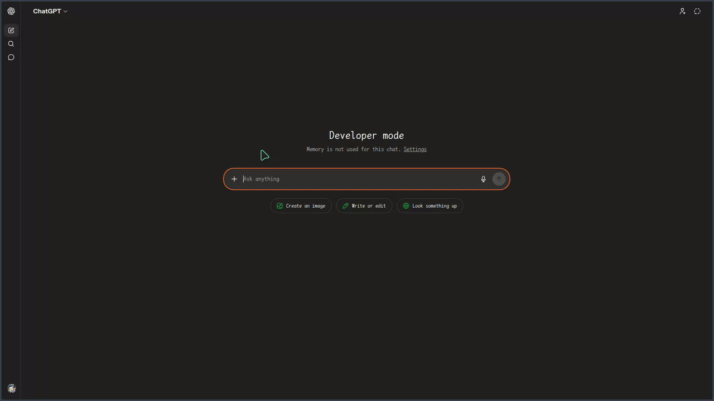
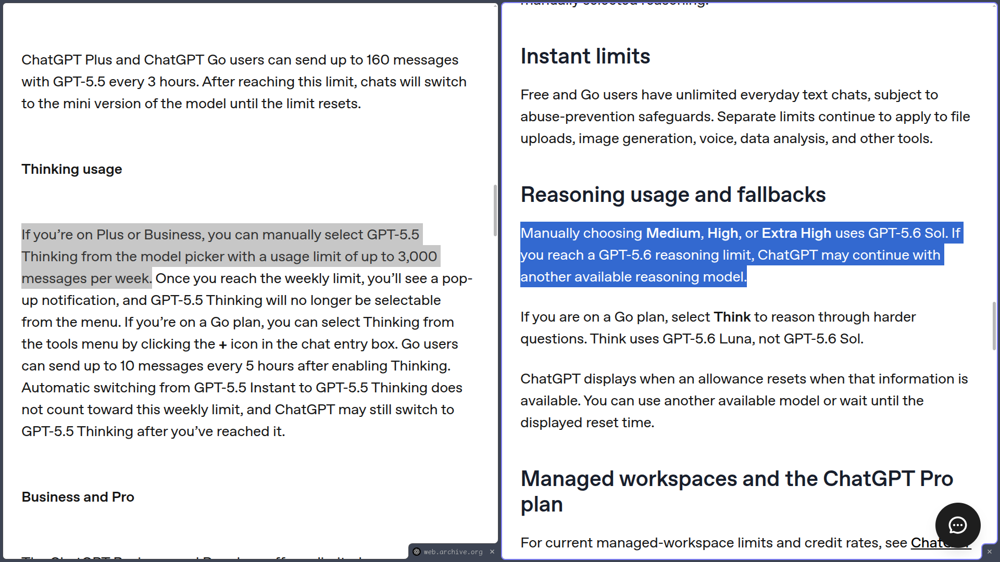

# MoonDesk

An open-source tool that lets you use ChatGPT Chat as a local coding agent. No reverse engineering, no API, no Codex, no Work mode. A ChatGPT Plus subscription is enough.

> [!NOTE]
> MoonDesk is maintained by **Shattermoon** and starts from the lightweight CatDesk experimental codebase. MoonDesk replaces the legacy mascot system with **ClippyMoon**, a deterministic procedural moon companion generated locally from a random seed.

<p align="center">
  <br>
  <em>MoonDesk in ChatGPT Web</em>
</p>

# Disclaimer

This is an independent open-source project and is not affiliated with or endorsed by OpenAI. I built it as a personal tool and decided to open-source it. Some features are still buggy and may cause unexpected behavior. Use it at your own risk. I am not responsible for any loss caused by this tool. It is strongly recommended to run it inside a VM or container.

# Why MoonDesk?

Codex has a very generous weekly quota (reset usage frequently) compared to Antigravity (good at good morning) and Claude Code (RIP 5h quota 💀), that's why I love OpenAI so much.

<p align="center">
  <br>
  <em>Codex reset usage frequently🙏</em>
</p>

However, the quota runs out very quickly if you work on a large project.

<p align="center">
  <br>
  <em>I used up my Codex quota on the first day after it reset</em>
</p>

Then you need to wait another 7 days. What are you going to do for the rest of the week?

Here's the solution: most people with a Plus subscription do not use even 10% of their weekly thinking messages.

**_So why not use your 3,000 weekly messages for coding?_**

That's the idea behind MoonDesk! It gives ChatGPT Web tools like `write` and `run_command` to edit files on your computer.

<p align="center">
  <br>
  <em>GPT-5.5: <a href="https://web.archive.org/web/20260519111010/https://help.openai.com/en/articles/11909943-gpt-55-in-chatgpt">3,000 messages/week</a>, GPT-5.6: <a href="https://help.openai.com/en/articles/20001354-gpt-56-in-chatgpt">unknown</a> but I have never hit the limit</em>
</p>

# How does this work?

1. A ChatGPT Plus or above subscription is required.
2. MoonDesk runs as a local MCP server on your computer. It has the ability to run commands and edit files, just like Codex.
3. You can connect ChatGPT Web to MoonDesk using a Custom Connector, which is a feature available only to Plus and Pro users.
4. Done! Now ChatGPT Web can control your computer and code on it.

In short,

```text
ChatGPT Web + MoonDesk
= a stripped-down version of Codex
= OpenClaw without cron and other active utilities
```

I tried this with GPT-5.2 before, and the results were poor. However, **GPT-5.4 Thinking is now really good at tool calling and computer use.** The first time I tried it with GPT-5.4, I was honestly surprised by how well it worked. GPT-5.5 and GPT-5.6 are even smoother, and GPT-5.6 is extremely good at using MoonDesk. It's also very fast.

# Differences between ChatGPT Chat + MoonDesk, Codex, and the API (let's say Plus plan)

|       | ChatGPT Chat + MoonDesk                             | Codex                   | OpenAI API           |
| ----- | -------------------------------------------------- | ----------------------- | -------------------- |
| Usage | 3,000 messages/week                                | Generous weekly quota   | Pay as you go        |
| Pros  | Stable, no extra fee, and nearly unlimited\* quota | Stable and no extra fee | Stable               |
| Cons  | Not as smooth as native Codex                      | Runs out very quickly   | Tokens are expensive |

\*Let's say you sleep 6 hours a day and use MoonDesk every day. In that case, you can send 3,000 / (24 - 6) / 7 = 23.8 messages per hour. Since thinking and tool calls take time, it is very difficult to use up your weekly 3,000 message limit.

# Who needs this?

- People who used up their Codex quota on the first few day after it reset (me🥺)
- People who are working on web development and crawlers. (MoonDesk enables ChatGPT Web to read elements and control your browser tab through chrome-devtools-mcp integration.)

# Quickstart

> [!CAUTION]
> This tool is very powerful and can potentially wipe your whole disk or produce unexpected results.
> Run it inside a VM or container (DevContainer is a good option).
> Treat it like OpenClaw, keep it containerized and isolated.

1. Install MoonDesk globally with npm.

   ```bash
   npm install -g moondesk
   ```

2. Run MoonDesk from any terminal directory.

   ```bash
   moondesk
   ```

   When MoonDesk starts, choose `Control Computer`, `Control Browser`, or `Both`. If browser control is enabled, select a supported Chromium browser.

   On first launch, MoonDesk will ask you to enter your **ngrok authtoken** and **ngrok static domain** (e.g. `my-app.ngrok-free.dev`). You can get both from the [ngrok dashboard](https://dashboard.ngrok.com/get-started/setup). These are saved to `~/.moondesk/config.toml` and reused on subsequent launches.

   By default, MoonDesk listens on port `3200`. You can override it with `PORT`. The workspace root defaults to the current working directory and can be overridden with `WORKSPACE_ROOT`.

   On macOS Terminal.app, MoonDesk manages a dedicated `MoonDesk` Terminal profile automatically. If the current Terminal tab is not already using that profile, MoonDesk applies it, closes any temporary helper window, and asks you to run the same command again in that tab. It only starts immediately when the current tab is already using `MoonDesk`. Set `MOONDESK_SKIP_MACOS_TERMINAL_PROFILE=1` if you want to keep the current Terminal session untouched.

3. Wait for the TUI to show the MCP Server URL.

4. Open [ChatGPT connector settings](https://chatgpt.com/plugins#settings/Connectors?create-connector=true&redirectAfter=%2Fplugins).

5. In the pop-up window, fill in the connector form:
   - Name: `MoonDesk` or any name you like
   - MCP Server URL: the full URL shown in MoonDesk TUI
   - Authentication: `None`

6. Click `I understand and want to continue`.

7. Click `Create`, then click `Connect`.

   - Permission defaults to **Allow read actions**. For the smoothest experience, I recommend **Allow all actions** (equivalent to Codex's `--yolo`; use with caution).

8. Add this to your ChatGPT `Custom instructions`:

```text
MoonDesk is a coding tool and a custom connector. Always use MoonDesk if the user wants to do anything related to file operations. Always call `moondesk_instruction` after `list_resources`, and follow the instructions it contains.
```

9. Start using the connector from ChatGPT Web. Some important tips:

- I recommend let ChatGPT to decide which connector automatically. You can manually selecting the connector using `/` or `@`. This way, ChatGPT can only access the connector you selected, which may improve stability. However, the downside is, `web.search` and `web.open` will be disabled. Which means it can't search latest info. The `web` tool and a custom connector cannot be used at the same time.

<table align="center">
  <tr>
    <td align="center">
      <br>
      <em>Select MoonDesk manually with <code>/</code></em>
    </td>
    <td align="center">
      <br>
      <em>Select MoonDesk manually with <code>@</code></em>
    </td>
  </tr>
</table>

- To improve performance and avoid high memory usage, I strongly recommend **opening a new session for every small feature**. If you need context, you can ask ChatGPT to create a handoff note and paste it into the new session. It will become extremely laggy after 50+ tool calls.
<p align="center">
  <br>
  <em>3.9 GB Memory usage🥹</em>
</p>


# Stack

| Part | Stack |
| --- | --- |
| Core | Rust |
| MCP server | Custom implementation (no SDK) |
| MCP protocolVersion | `2025-11-25` |
| Server | Axum + Tokio |
| TUI | Ratatui |
| Tunnel | ngrok |
| Browser control | chrome-devtools-mcp |
| Distribution | npm |

# Tools

MoonDesk has two local tool modes: `multi-tools` exposes 11 tools, and `read-only` exposes 3 tools.

MoonDesk's local tools in `multi-tools` mode are:

| Tool                  | Type  | What it does                                                               |
| --------------------- | ----- | -------------------------------------------------------------------------- |
| `moondesk_instruction` | Guide | Returns MoonDesk usage instructions                                        |
| `read`                | Read  | Reads bounded line ranges or byte chunks from a workspace text file        |
| `search`              | Read  | Searches workspace text and returns compact bounded results                |
| `write`               | Write | Creates or overwrites a file                                               |
| `edit`                | Write | Replaces exact text inside a file                                          |
| `delete`              | Write | Deletes a file or directory                                                |
| `run_command`         | Shell | Runs a short shell command and waits for completion                        |
| `start_command`       | Job   | Starts a long-running shell command and immediately returns a job ID       |
| `poll_command`        | Job   | Reads incremental output and status from a background command              |
| `read_command_output` | Read  | Reads bounded chunks from complete preserved command stdout/stderr         |
| `cancel_command`      | Job   | Stops a background command and its child process tree                      |

Long-running commands are deliberately decoupled from the lifetime of an MCP HTTP request. Builds, compilation, dependency installation, long test suites, development servers, and commands expected to produce large output should use `start_command`, then `poll_command`. The first poll uses `after: 0`; every later poll must pass the previous `nextCursor`, so each response contains only new output. Poll responses stay bounded. Complete stdout/stderr is also preserved locally for the MoonDesk session, so if a poll reports `outputTruncated`, `read_command_output` can recover either full stream in bounded byte chunks using the same job ID. `run_command` remains the simpler path for short commands; if its inline 1 MiB-per-stream capture is exceeded, it returns an `outputId` that `read_command_output` can use instead of permanently discarding the overflow.

On wide terminals, the lower TUI is split into a compact Logs pane and a larger Shell Commands pane. Shell Commands is focused by default. `Tab`/`Shift+Tab` switches pane focus; arrow keys, Page Up/Down, and the mouse wheel select/scroll entries in the focused or pointed pane; Home/End jumps to the first/latest entry. Clicking a rendered row selects it. Long log messages and shell commands stay compact with an explicit ellipsis; press `Enter` or `Space` to expand the selected row and wrap its full locally stored text, then `Esc` to collapse it. Shell command entries always keep one blank line between executions for readability. Each pane keeps independent scroll/follow state, so inspecting command history no longer moves the Logs pane.

On sufficiently wide terminals, the bottom of the MoonDesk TUI is split into `Logs` and `Shell Commands`. The command panel is local-only: it shows `run_command`/`start_command` immediately when the request arrives, then updates that command with bounded progress/result previews from later responses and polls. This does not add command data or result previews to ChatGPT's MCP responses.

`read` defaults to 200 lines and exposes `nextStartLine` for normal pagination. If one line is too large for a single response, MoonDesk returns a bounded byte chunk and `nextStartByte`; continue with `start_byte`/`max_bytes` so minified files, source maps, and other long-line text remain fully inspectable without one huge tool result.

If browser mode is enabled, MoonDesk can also expose extra browser/devtools tools. Those are provided by the browser bridge, so the exact list depends on your environment.

`search` uses `rg` when it is available, falls back to `grep`, then falls back to MoonDesk's built-in scanner. Installing ripgrep is optional, but gives the best search performance and behavior.

# Context window

According to [the blog](<https://help.openai.com/en/articles/11909943-gpt-53-and-gpt-54-in-chatgpt#:~:text=Thinking%20(GPT%E2%80%915.4%20Thinking)>) and [the code](https://github.com/openai/codex/blob/main/codex-rs/models-manager/src/model_info.rs#L85), the context window in ChatGPT web is different from Codex.

| Tier | MoonDesk + ChatGPT Web (in + out = sum) | Codex CLI (sum)        |
| ---- | -------------------------------------- | ---------------------- |
| Plus | 128K + 128K = 256K                     | 258K (1M experimental) |
| Pro  | 272K + 128K = 400K                     | 258K (1M experimental) |

# FAQ

### I've already connected. Why do I need to connect again and again?

There doesn't seem to be any obvious pattern for when the connector triggers `Connect`. I'm sure it's not triggered by the tool call count, but I don't know the exact reason.

<table align="center">
  <tr>
    <td align="center">
      <br>
      <em>Connector asks to connect again</em>
    </td>
    <td align="center">
      <br>
      <em>Connector asks to connect again (After you click Continue)</em>
    </td>
  </tr>
</table>

I know it’s annoying. I’m trying to find a solution now.

### Can MoonDesk be used in other apps?

Yes, in theory. MoonDesk may also work with other apps that support custom remote MCP servers, including Claude. (I don't think anyone will use MoonDesk with Claude though, since Claude Chat mode and Claude Code share the same usage limits.)

However, MoonDesk is built specifically for ChatGPT Chat and its Custom Connector (They renamed it to _Apps_, and now they renamed it again and call it _Plugins_, but to prevent confusion with _Application_, I still prefer call it _Connector_) flow. ChatGPT Chat is the environment MoonDesk is designed and tested for, so other apps may not work as smoothly.

### How does the input/output token be calculated?

MoonDesk does not get official token usage numbers from ChatGPT Web. It estimates them locally with `o200k_base`, the same tokenizer family used by GPT-5.5-style models, so the numbers are useful, but still only estimates.

| Field          | Symbol | What it means                | Price                         |
| -------------- | ------ | ---------------------------- | ----------------------------- |
| `inputTokens`  | `↓`    | Tool input ≈ LLM output      | ≈ `$30.00 / 1M` output tokens |
| `outputTokens` | `↑`    | Tool output ≈ LLM input      | ≈ `$5.00 / 1M` input tokens   |
| `totalTokens`  | `Σ`    | `inputTokens + outputTokens` | `input price + output price`  |

MoonDesk does not count:

- the full ChatGPT conversation
- hidden prompts or reasoning tokens
- other internal tokens on OpenAI's side

These estimates stay local to MoonDesk for its own counters and are not attached to MCP tool responses sent back to ChatGPT.

### What is workspace?

Workspace is the root directory MoonDesk is allowed to work in.

By default, it is the directory where you launch MoonDesk. You can also override it with `WORKSPACE_ROOT`.

File tools use this directory as their base path, and paths outside the workspace are rejected.

### Where to put my AGENTS.md?

You can put it in 3 places.

1. Workspace root
2. `~/.moondesk/AGENTS.md`
3. `~/.codex/AGENTS.md`

MoonDesk checks these locations for `AGENTS.md` in this order. This happens every time `moondesk_instruction` is called. You can also manually choose which `AGENTS.md` to use.

<p align="center">
  <br>
  <em>Set AGENTS.md manually</em>
</p>

# Safety

> [!CAUTION]
> Do **NOT** share the `MCP Server URL` with anyone. Anyone with the URL can access your computer.

The URL is made of these parts:

| Part         | Example                       | What it means                                |
| ------------ | ----------------------------- | -------------------------------------------- |
| Public URL   | `https://xxxx.ngrok-free.dev` | Your ngrok static domain                     |
| Random path  | `/Ab3kL9xQ2pTm7VhC`           | A random path generated on first launch      |
| MCP endpoint | `/mcp`                        | The actual MCP endpoint                      |

So the full URL looks like this:

```text
https://xxxx.ngrok-free.dev/Ab3kL9xQ2pTm7VhC/mcp
```

Both the static domain and the random path are persisted in `~/.moondesk/config.toml`, so the full MCP URL stays the same across launches. You only need to set up the connector once.

# About ClippyMoon

ClippyMoon is MoonDesk's procedural lunar companion. It is generated entirely in Rust from a random 64-bit seed when MoonDesk starts; no image-generation model or bundled sprite sheet is used.

A seed determines ClippyMoon's identity: one of the eight major moon phases, an Earth-visible color mood, crater layout, facial expression, blush, and surrounding stars. The current color families are pale ivory, silver, warm yellow, harvest orange, amber, copper, and blood red. Animation then changes only temporary frame state such as blinking, subtle one-pixel bobbing, and star twinkling, so the same seed always recreates the same character.

Normal MoonDesk startup keeps ClippyMoon entirely in memory: nothing is archived or persisted and each launch creates a fresh random moon. The current moon's 16-digit hexadecimal seed is written once to the TUI log so it can be reproduced without saving mascot state. Export is explicit and opt-in. Run `moondesk clippymoon export` to create `clippymoon.png` and `clippymoon.gif` in the current directory, or use `--seed <hex>` to reproduce a specific moon and `--out <directory>` to choose the destination. Both exports are 512×512 pixel art; the GIF uses the same idle-animation sequence as the TUI and loops indefinitely. MoonDesk never writes these files unless the export command is invoked.
